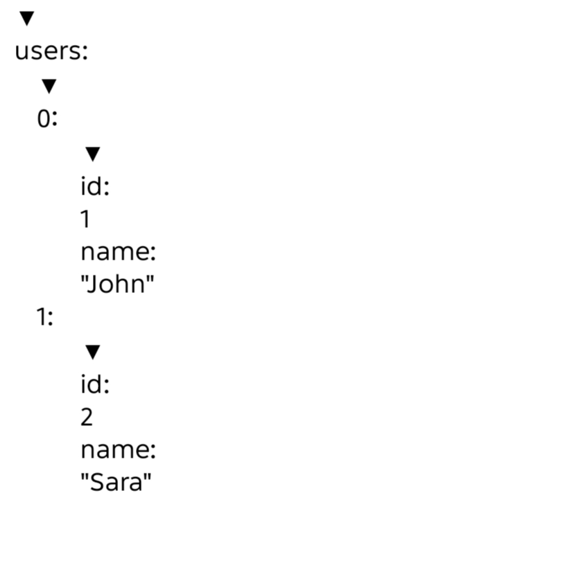

# React Native JSON Inspector

A lightweight, customizable JSON viewer and inspector for React Native and Expo applications.

[](https://www.npmjs.com/package/react-native-json-inspector)
[](LICENSE)

## Features

- 🌳 JSON tree visualization
- 🔽 Expand / collapse objects and arrays
- ⚡ Lightweight and dependency-friendly
- 📱 React Native compatible
- 🚀 Expo compatible
- 🎨 Customizable themes
- 📝 TypeScript support

## Preview



## Installation

### npm

```bash
npm install react-native-json-inspector
```

### yarn

```bash
yarn add react-native-json-inspector
```

## Usage

```tsx
import React from "react";
import { View } from "react-native";
import { JsonInspector } from "react-native-json-inspector";

const data = {
  user: {
    name: "John Doe",
    age: 28,
    active: true,
  },
};

export default function App() {
  return (
    <View style={{ flex: 1 }}>
      <JsonInspector data={data} defaultExpandedDepth={2} theme="light" />
    </View>
  );
}
```

## Props

| Prop                 | Type    | Default  | Description            |
| -------------------- | ------- | -------- | ---------------------- | ---------- |
| data                 | any     | Required | JSON data to display   |
| defaultExpandedDepth | number  | 1        | Initial expanded depth |
| theme                | "light" | "dark"   | "light"                | Theme mode |

## Roadmap

### v0.1.0-alpha.1

- ✅ JSON tree viewer
- ✅ Expand / collapse nodes
- ✅ Theme support
- ✅ TypeScript support
- ✅ React Native support
- ✅ Expo compatibility

### v0.2.0

- 🔍 Search functionality
- 📋 Copy value
- 📍 Copy JSON path
- 🎨 Enhanced styling

### v0.3.0

- ⚡ Virtualized rendering
- 📦 Large JSON support
- 🧩 Custom renderers
- 🌙 Advanced theme customization

## Contributing

Contributions, bug reports, feature requests, and suggestions are welcome.

## Before Starting Any Work

If you discover a bug, have an improvement idea, or want to propose a new feature:

1. Open a GitHub Issue describing the problem, suggestion, or enhancement.
2. Wait for discussion and approval from the maintainers.
3. Once the issue is approved and assigned, you may start working on it.
4. Submit a Pull Request referencing the related issue.

**Please do not start development before opening an issue and receiving approval.**

This helps avoid duplicate work and ensures that proposed changes align with the project's roadmap.

## Contribution Process

1. Fork the repository.

2. Create a new branch from `main`.

```bash
git checkout -b feature/your-feature-name
```

3. Make your changes.

4. Test your changes thoroughly.

5. Commit your changes.

```bash
git commit -m "feat: add new feature"
```

6. Push your branch.

```bash
git push origin feature/your-feature-name
```

7. Open a Pull Request and link the related GitHub Issue.

## Reporting Bugs

When reporting a bug, please include:

- React Native version
- Expo version (if applicable)
- Device/Platform
- Steps to reproduce
- Expected behavior
- Actual behavior
- Screenshots (if applicable)

## Feature Requests

Feature requests should include:

- Problem statement
- Proposed solution
- Example use cases
- Any relevant screenshots or references

## Code Style Guidelines

- Follow the existing project structure and coding conventions.
- Keep components reusable and maintainable.
- Write clear and meaningful commit messages.
- Avoid introducing breaking changes without prior discussion.

Thank you for helping improve **React Native JSON Inspector**! 🚀

## Links

- GitHub Repository: https://github.com/Abbasali343/react-native-json-inspector
- npm Package: https://www.npmjs.com/package/react-native-json-inspector

## License

MIT License © Abbas Ali Akhtar
